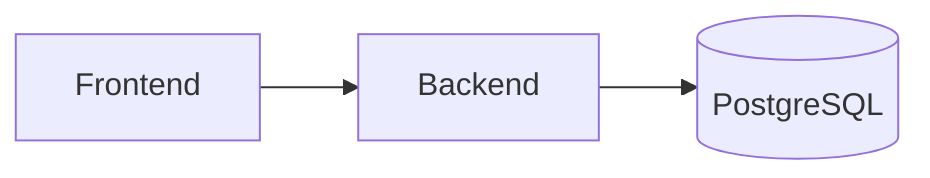
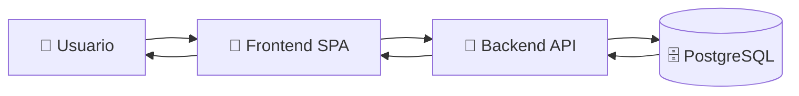

# 🌡️ LATIDO_TERMICO

> **Contenedor global del ecosistema web**

## 🏗️ Arquitectura General

```text
LATIDO_TERMICO/
│
├── .github/
│   └── workflows/
│       └── ci-cd.yml
│
├── backend/
├── frontend/
├── docs/
├── scripts/
│
├── docker-compose.yml
├── .gitignore
└── README.md
```

---

# 📂 Estructura del Proyecto

## ⚙️ `.github/workflows/ci-cd.yml`

### Integración y Despliegue Continuo (CI/CD)

Automatiza la validación del sistema cada vez que se realiza un cambio en GitHub.

### Funciones principales

✅ Ejecuta pruebas automatizadas del Frontend  
✅ Ejecuta pruebas automatizadas del Backend  
✅ Detecta errores antes de llegar a producción  
✅ Mantiene la calidad y estabilidad del código

> **Objetivo:** Evitar que código defectuoso sea desplegado en ambientes productivos.

---

## 🧠 `/backend`

### Núcleo del Sistema

Contiene toda la lógica de negocio y procesamiento de datos.

### Responsabilidades

- 🔐 Sistema de autenticación (JWT)
- 🗄️ Gestión de Base de Datos PostgreSQL
- 📦 Modelos y entidades
- 🎯 Reglas de negocio
- 🔄 Exposición de API REST o GraphQL

### Importante

El backend **no genera interfaces visuales**.

Su única función es procesar solicitudes y responder datos estructurados (JSON).



---

## 🎨 `/frontend`

### Cliente Web (SPA)

Aplicación encargada exclusivamente de la experiencia del usuario.

### Responsabilidades

- 🖥️ Renderizar la interfaz gráfica
- 🖱️ Capturar acciones del usuario
- 📡 Consumir servicios del Backend
- 🔄 Actualizar información en tiempo real

### Importante

El frontend **nunca accede directamente a la base de datos**.


---

## 📚 `/docs`

### Centro de Documentación

Sirve como punto de referencia técnico para todos los equipos involucrados.

### Contenido

- 📄 Especificaciones OpenAPI / Swagger
- 🏛️ Diagramas de arquitectura
- 📘 Manuales técnicos
- 🔌 Contratos de API

### Beneficio

Facilita la colaboración entre:

- Equipo Web
- Equipo Móvil
- Equipo DevOps
- Equipo QA

---

## 🤖 `/scripts`

### Automatización Operativa

Contiene herramientas para reducir tareas manuales repetitivas.

### Ejemplos

- 🐍 Scripts Python
- 🐚 Scripts Bash
- 💾 Respaldos automáticos
- 🔄 Migraciones rápidas
- 🧹 Limpieza de datos
- 📊 Generación de reportes

---

## 🚫 `.gitignore`

### Control de Archivos Excluidos

Define qué archivos NO deben enviarse al repositorio.

### Ejemplos comunes

```gitignore
node_modules/
.env
dist/
build/
__pycache__/
venv/
```

### Beneficios

✅ Protege información sensible  
✅ Reduce el tamaño del repositorio  
✅ Evita conflictos innecesarios

---

## 🐳 `docker-compose.yml`

### Entorno de Desarrollo Unificado

Permite iniciar toda la infraestructura local con un solo comando.

```bash
docker compose up -d
```

### Servicios levantados

- ⚙️ Backend
- 🗄️ PostgreSQL
- 🎨 Frontend

### Ventaja

> "Funciona igual en mi computadora y en la tuya."

Reduce diferencias entre entornos de desarrollo.

---

## 📖 `README.md`

### Punto de Entrada para Desarrolladores

Documento principal del proyecto.

### Debe incluir

- 🚀 Introducción al sistema
- 📥 Cómo clonar el repositorio
- 🔧 Instalación de dependencias
- ▶️ Ejecución local
- 🧪 Ejecución de pruebas
- 🐳 Uso de Docker
- 🤝 Guías de contribución

### Objetivo

Permitir que cualquier desarrollador pueda levantar el proyecto en pocos minutos.

---

# 🔄 Flujo General de la Plataforma



---

# 🎯 Filosofía de la Arquitectura

| Componente | Responsabilidad |
|------------|----------------|
| 🎨 Frontend | Presentación e interacción |
| 🧠 Backend | Procesamiento y reglas de negocio |
| 🗄️ PostgreSQL | Persistencia de datos |
| 📚 Docs | Comunicación técnica |
| 🤖 Scripts | Automatización |
| ⚙️ CI/CD | Calidad y despliegue continuo |
| 🐳 Docker | Entorno consistente |
| 📖 README | Onboarding de desarrolladores |

---

> **LATIDO_TERMICO** busca una arquitectura desacoplada, escalable y mantenible, donde cada componente tenga una responsabilidad clara y bien definida.